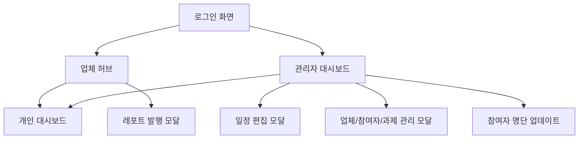
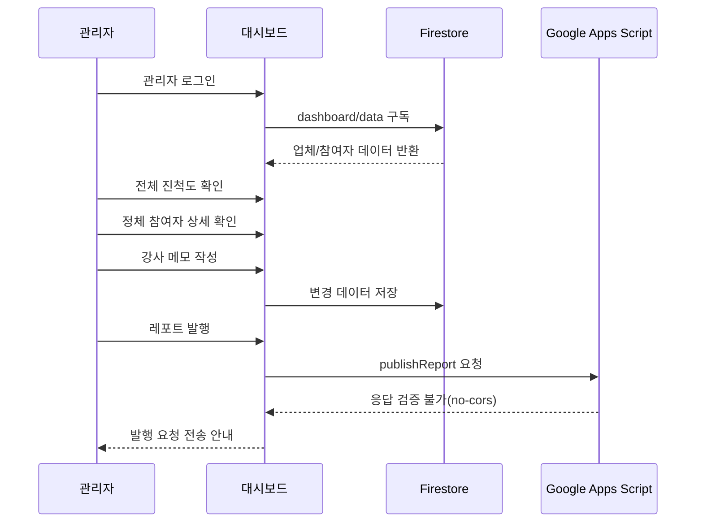
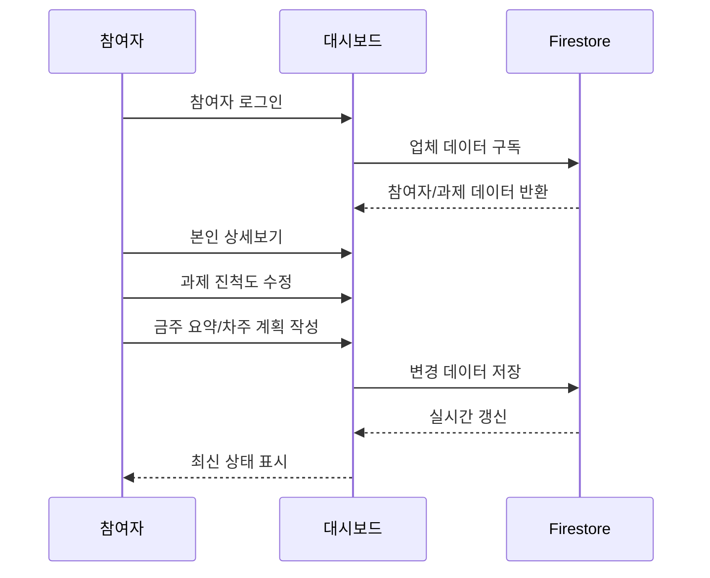

# [UX 시나리오 상세 설계서] AI 프로젝트 통합 대시보드

---

## 1. 문서 목적

본 문서는 AI 프로젝트 통합 대시보드의 사용자 경험을 역할별, 화면별, 업무 흐름별로 상세 정의하기 위한 UX 시나리오 설계서이다.

본 문서는 실제 사용자가 어떤 맥락에서 화면에 진입하고, 어떤 판단을 하며, 어떤 작업을 완료하는지를 중심으로 정리한다.

본 문서의 주요 활용 대상은 다음과 같다.

| 대상 | 활용 목적 |
|---|---|
| 기획자 | 사용자 흐름, 예외 상황, 화면별 요구사항 검토 |
| UX/UI 디자이너 | 화면 상태, 권한별 인터랙션, 빈 상태/오류 상태 설계 |
| 프론트엔드 개발자 | 컴포넌트 동작, 권한 분기, 사용자 액션별 상태 변화 확인 |
| QA 담당자 | 시나리오 기반 테스트 케이스 도출 |
| 운영자/강사 | 실제 교육 운영 흐름과 시스템 지원 범위 확인 |

---

## 2. UX 설계 원칙

### 2.1 역할 기반 명확성

사용자는 관리자와 참여자로 나뉘며, 두 역할은 같은 데이터를 보더라도 목적과 권한이 다르다.

관리자는 전체 현황을 빠르게 파악하고 개입해야 하며, 참여자는 본인의 과제 진척과 보고 내용을 쉽게 갱신해야 한다. 따라서 화면은 "누가 무엇을 할 수 있는가"가 즉시 드러나야 한다.

### 2.2 운영 흐름 중심

이 대시보드는 단순 조회 화면이 아니라 교육 운영 도구이다. UX는 다음 운영 흐름을 끊기지 않게 지원해야 한다.

1. 참여자 등록 및 로그인
2. 업체별 참여자 현황 확인
3. 개인별 과제 진척 업데이트
4. 강사 피드백 작성
5. 주간 레포트 발행
6. 구글 시트로 참여자 명단 및 보고 데이터 전달

### 2.3 실시간 협업의 신뢰감

Firestore 실시간 구독을 통해 여러 사용자의 변경사항이 즉시 반영된다. 다만 현재 구현은 문서 전체 덮어쓰기 방식이므로 동시 편집 시 마지막 저장 데이터가 이전 저장 데이터를 덮을 수 있다.

UX 관점에서는 사용자가 "내가 저장한 내용이 반영되었다"는 피드백과 "다른 사용자의 변경으로 화면이 갱신되었다"는 맥락을 구분해 인지할 수 있어야 한다.

### 2.4 실패 가능성의 투명성

현재 GAS 연동은 `no-cors` 요청으로 응답 검증이 불가능하다. 따라서 실제 성공 여부를 확인하지 못한 상태에서 성공 메시지를 표시할 수 있다.

UX 문구는 "발행 완료"보다 "발행 요청을 전송했습니다"처럼 시스템이 확실히 보장할 수 있는 범위에 맞춰야 한다.

---

## 3. 사용자 역할 정의

### 3.1 관리자(강사)

| 항목 | 내용 |
|---|---|
| 주요 목적 | 업체별/참여자별 진척도 파악, 과제 관리, 피드백 작성, 레포트 발행 |
| 주요 화면 | 관리자 대시보드, 업체 허브, 개인 대시보드, 레포트 모달 |
| 주요 권한 | 업체 추가/삭제, 참여자 추가/삭제, 과제 추가/수정/삭제, 일정 편집, 강사 메모 작성, 레포트 발행 |
| 주요 리스크 | 관리자 비밀번호가 클라이언트에 하드코딩되어 있어 보안 수준이 낮음 |
| UX 니즈 | 전체 상황을 한눈에 파악하고 정체 참여자를 빠르게 찾아 조치 |

### 3.2 참여자(수강생)

| 항목 | 내용 |
|---|---|
| 주요 목적 | 본인 과제 진척도 업데이트, 금주 요약/차주 계획 작성, 강사 피드백 확인 |
| 주요 화면 | 로그인, 업체 허브, 개인 대시보드 |
| 주요 권한 | 본인 상태 변경, 본인 과제 진척도 변경, 본인 과제 추가/삭제, 본인 보고 내용 작성 |
| 제한 사항 | 다른 참여자의 데이터 편집 불가, 관리자 전용 기능 접근 불가 |
| UX 니즈 | 별도 계정 생성 없이 빠르게 접속하고 본인 작업만 혼란 없이 수정 |

---

## 4. 정보 구조(IA)

현재 앱은 라우터 없이 탭 상태로 화면을 전환하는 SPA 구조이다.

### 4.1 주요 화면

| 화면 | 관리자 접근 | 참여자 접근 | 핵심 목적 |
|---|---:|---:|---|
| 로그인 | 가능 | 가능 | 역할 선택 및 접속 |
| 관리자 대시보드 | 가능 | 불가 | 전체 운영 현황 관리 |
| 업체 허브 | 가능 | 가능 | 업체 단위 참여자 현황 확인 및 상세 이동 |
| 개인 대시보드 | 가능 | 가능 | 참여자별 과제/보고/피드백 관리 |
| 레포트 발행 모달 | 가능 | 불가 | 주간 레포트 스프레드시트 발행 |
| 일정 편집 모달 | 가능 | 불가 | 업체별 프로젝트 일정 관리 |

---

## 5. 공통 UX 상태 정의

### 5.1 로딩 상태

Firestore 데이터 구독 초기화 중에는 화면이 즉시 조작 가능한 것처럼 보이면 안 된다.

권장 UX:

- 로그인 이후 데이터 로드 중에는 "데이터를 불러오는 중입니다" 상태를 표시한다.
- 데이터가 없는 경우 초기 시드 생성 중임을 안내한다.
- 네트워크 지연 시 중복 클릭을 방지하기 위해 주요 버튼에 로딩 상태를 표시한다.

### 5.2 빈 상태

| 상황 | 현재 의미 | 권장 안내 |
|---|---|---|
| 업체 없음 | 운영 대상 업체가 아직 등록되지 않음 | "등록된 업체가 없습니다. 업체를 추가해 프로젝트를 시작하세요." |
| 참여자 없음 | 특정 업체에 참여자가 없음 | "아직 참여자가 없습니다. 참여자 등록 버튼으로 명단을 추가하세요." |
| 과제 없음 | 참여자가 수행할 과제가 없음 | "등록된 과제가 없습니다. 과제를 추가해 진척도를 관리하세요." |
| 요약 없음 | 참여자가 보고 내용을 작성하지 않음 | "금주 요약이 아직 작성되지 않았습니다." |

### 5.3 오류 상태

| 오류 유형 | 발생 가능 지점 | UX 처리 |
|---|---|---|
| 로그인 실패 | 관리자 비밀번호 불일치, 참여자 정보 불일치 | 원인과 다음 행동을 분리해 안내 |
| 저장 실패 | Firestore `setDoc` 실패 | 저장 실패 알림과 재시도 버튼 제공 |
| 발행 실패 | GAS 네트워크 오류 | "발행 요청 전송 실패"로 명확히 표시 |
| 권한 오류 | 참여자가 관리자 기능 접근 시도 | 화면 진입 차단 및 권한 안내 |
| 데이터 충돌 | 동시 편집으로 이전 값 덮어쓰기 | 향후 개선: 최근 저장자/시간 표시 및 충돌 알림 |

---

## 6. UX 시나리오 상세

## 6.1 로그인 및 신규 등록 시나리오

### 시나리오 A: 관리자가 로그인한다

| 항목 | 내용 |
|---|---|
| 사용자 | 관리자(강사) |
| 목표 | 전체 현황 관리 화면으로 진입 |
| 진입 조건 | 앱 첫 화면 접근 |
| 완료 조건 | 관리자 대시보드 또는 업체 허브 접근 가능 |

#### 기본 흐름

1. 사용자는 로그인 화면에서 "관리자" 탭을 선택한다.
2. 비밀번호를 입력한다.
3. 시스템은 입력값을 클라이언트 내 관리자 비밀번호와 비교한다.
4. 비밀번호가 일치하면 관리자 권한 상태로 전환한다.
5. 사용자는 전체 업체/참여자 현황을 볼 수 있다.

#### 예외 흐름

| 상황 | 시스템 반응 | UX 권장 |
|---|---|---|
| 비밀번호 불일치 | 로그인 실패 | "비밀번호가 올바르지 않습니다." 표시 |
| 빈 비밀번호 제출 | 로그인 실패 | 입력 필드 하단에 필수 입력 안내 |
| 새로고침 | 인증 상태 초기화 | 보안상 재로그인 필요 안내 |

#### 개선 제안

- 관리자 비밀번호는 클라이언트 코드가 아닌 Firebase Authentication 기반으로 전환한다.
- 로그인 실패 횟수 제한 또는 일정 시간 잠금 정책을 추가한다.
- 세션 유지 여부를 명확히 선택할 수 있게 한다.

---

### 시나리오 B: 기존 참여자가 로그인한다

| 항목 | 내용 |
|---|---|
| 사용자 | 참여자 |
| 목표 | 본인이 속한 업체 허브 또는 개인 대시보드로 진입 |
| 진입 조건 | 업체에 참여자 데이터가 이미 등록되어 있음 |
| 완료 조건 | 참여자 본인 권한으로 접속 완료 |

#### 기본 흐름

1. 사용자는 로그인 화면에서 "참여자" 탭을 선택한다.
2. 업체를 선택한다.
3. 이름과 이메일을 입력한다.
4. 시스템은 선택한 업체의 참여자 목록에서 이름/이메일 일치 항목을 찾는다.
5. 일치하는 참여자가 있으면 해당 참여자 권한으로 로그인한다.
6. 사용자는 업체 허브에서 동료 현황을 보고, 본인 개인 대시보드로 이동할 수 있다.

#### 예외 흐름

| 상황 | 시스템 반응 | UX 권장 |
|---|---|---|
| 업체 미선택 | 로그인 불가 | 업체 선택 필드 강조 |
| 이름/이메일 불일치 | 신규 등록 플로우로 전환 | "등록된 정보가 없습니다. 신규 등록하시겠습니까?" |
| 이메일 오타 | 기존 사용자임에도 미등록 처리 가능 | 이메일 형식 검증 및 재확인 단계 제공 |

#### 개선 제안

- 이름과 이메일이 모두 일치해야 하는 조건을 화면에 명확히 안내한다.
- 이메일 대소문자, 앞뒤 공백을 자동 정규화한다.
- 기존 참여자 후보가 있을 경우 "혹시 이 사용자인가요?" 수준의 보조 확인을 제공할 수 있다.

---

### 시나리오 C: 신규 참여자가 자율 등록한다

| 항목 | 내용 |
|---|---|
| 사용자 | 신규 참여자 |
| 목표 | 관리자 개입 없이 업체에 본인을 등록하고 접속 |
| 진입 조건 | 이름/이메일이 기존 참여자 목록에 없음 |
| 완료 조건 | 신규 참여자 데이터 생성 후 자동 로그인 |

#### 기본 흐름

1. 사용자는 업체, 이름, 이메일을 입력한다.
2. 시스템은 일치하는 참여자가 없음을 확인한다.
3. 부서 입력 필드가 추가로 표시된다.
4. 사용자는 부서를 입력하고 "신규 등록하고 접속"을 선택한다.
5. 시스템은 신규 참여자를 해당 업체의 `participants` 배열에 추가한다.
6. 사용자는 자동 로그인된다.

#### 예외 흐름

| 상황 | 시스템 반응 | UX 권장 |
|---|---|---|
| 부서 미입력 | 등록 불가 | 부서 입력 필드에 오류 표시 |
| 같은 이메일 중복 등록 | 현재는 방지 로직 약함 | 동일 이메일 존재 시 확인 모달 제공 |
| 잘못된 업체 선택 | 잘못된 업체에 등록 가능 | 등록 전 업체명 확인 문구 제공 |

#### 개선 제안

- 신규 등록 완료 후 "등록 정보 확인" 화면을 짧게 보여준다.
- 관리자가 신규 등록자를 식별할 수 있도록 "신규 등록" 배지 또는 등록 시각을 저장한다.

---

## 6.2 관리자 대시보드 시나리오

### 시나리오 D: 관리자가 전체 운영 현황을 확인한다

| 항목 | 내용 |
|---|---|
| 사용자 | 관리자 |
| 목표 | 전체 업체 수, 참여자 수, 평균 진척도를 빠르게 파악 |
| 진입 조건 | 관리자 로그인 완료 |
| 완료 조건 | 정체 참여자 또는 관리 대상 업체를 식별 |

#### 기본 흐름

1. 관리자는 관리자 대시보드에 진입한다.
2. 상단 통계 카드에서 총 업체 수, 총 참여자 수, 평균 진척도를 확인한다.
3. 업체별 일정 관리 영역에서 각 업체의 시작일, KickOff, 종료일을 확인한다.
4. 전사 실습 현황 테이블에서 모든 참여자의 업체, 이름, 과제, 진척도, 상태, 강사 메모를 확인한다.
5. 필요 시 특정 참여자의 과제를 추가/수정/삭제하거나 개인 대시보드로 이동한다.

#### 주요 판단 포인트

- 평균 진척도가 낮은 업체가 있는가?
- 일정 대비 실제 진척이 뒤처지는 참여자가 있는가?
- 강사 피드백이 필요한 참여자가 있는가?
- 주간 보고서 발행 전에 누락된 요약/계획이 있는가?

#### UX 권장

- 정체 상태 참여자와 낮은 진척도는 색상과 정렬로 우선 노출한다.
- 테이블은 업체, 부서, 상태, 진척도 기준 필터가 필요하다.
- 강사 메모가 비어 있는 참여자를 빠르게 찾을 수 있어야 한다.

---

### 시나리오 E: 관리자가 업체를 추가한다

| 항목 | 내용 |
|---|---|
| 사용자 | 관리자 |
| 목표 | 신규 프로젝트 업체 등록 |
| 진입 조건 | 관리자 대시보드 접근 |
| 완료 조건 | 업체 목록에 신규 업체 표시 |

#### 기본 흐름

1. 관리자는 "업체 추가" 버튼을 선택한다.
2. 업체명 입력 모달이 열린다.
3. 업체명을 입력하고 저장한다.
4. 시스템은 신규 업체 객체를 생성한다.
5. 업체 목록과 통계 카드가 갱신된다.

#### 예외 흐름

| 상황 | 시스템 반응 | UX 권장 |
|---|---|---|
| 업체명 미입력 | 저장 불가 | 필수 입력 오류 표시 |
| 중복 업체명 | 현재 명확한 방지 없음 | 중복 경고 및 계속 진행 여부 확인 |
| 저장 실패 | Firestore 반영 실패 | 실패 알림 및 재시도 제공 |

---

### 시나리오 F: 관리자가 업체별 일정을 수정한다

| 항목 | 내용 |
|---|---|
| 사용자 | 관리자 |
| 목표 | 프로젝트 시작일, KickOff, 종료일 설정 |
| 진입 조건 | 업체가 등록되어 있음 |
| 완료 조건 | 업체별 일정이 갱신되고 개인 대시보드의 일정 대비 실적 계산에 반영 |

#### 기본 흐름

1. 관리자는 업체별 일정 관리 영역에서 특정 업체의 편집 버튼을 선택한다.
2. 일정 편집 모달이 열린다.
3. 시작일, KickOff 일자, 종료일을 입력한다.
4. 저장 시 해당 업체의 `schedule` 값이 갱신된다.
5. 참여자 개인 대시보드의 목표 달성률 계산에 변경 일정이 반영된다.

#### UX 권장

- 종료일이 시작일보다 빠른 경우 저장을 차단한다.
- KickOff 일자는 시작일과 종료일 사이인지 검증한다.
- 일정 변경이 참여자 목표 달성률에 영향을 준다는 안내를 제공한다.

---

## 6.3 업체 허브 시나리오

### 시나리오 G: 사용자가 업체별 참여자 현황을 확인한다

| 항목 | 내용 |
|---|---|
| 사용자 | 관리자, 참여자 |
| 목표 | 같은 업체 참여자들의 부서별 현황과 진척도 확인 |
| 진입 조건 | 로그인 후 업체 선택 상태 |
| 완료 조건 | 특정 참여자의 상세 현황으로 이동하거나 업체 참여 현황을 확인 |

#### 기본 흐름

1. 사용자는 업체 허브 화면에 진입한다.
2. 좌측 영역에서 부서별로 그룹핑된 참여자 목록을 확인한다.
3. 각 참여자의 이름, 부서, 평균 진척도, 상태를 확인한다.
4. "상세보기"를 선택해 개인 대시보드로 이동한다.

#### 권한 차이

| 기능 | 관리자 | 참여자 |
|---|---:|---:|
| 모든 참여자 상세 조회 | 가능 | 가능 |
| 다른 참여자 데이터 편집 | 가능 | 불가 |
| 본인 데이터 편집 | 가능 | 가능 |
| 레포트 발행 | 가능 | 불가 |
| 참여자 등록 | 가능 | 가능 |

#### UX 권장

- 참여자가 다른 사람의 상세 화면에 들어갔을 때는 읽기 전용임을 명확히 표시한다.
- 본인 카드에는 "내 프로필" 또는 강조 표시를 제공한다.
- 부서가 많은 경우 접기/펼치기 또는 검색 기능을 제공한다.

---

## 6.4 개인 대시보드 시나리오

### 시나리오 H: 참여자가 본인 진척도를 업데이트한다

| 항목 | 내용 |
|---|---|
| 사용자 | 참여자 |
| 목표 | 본인 과제별 진척도와 상태를 최신화 |
| 진입 조건 | 참여자 로그인 후 본인 상세 화면 진입 |
| 완료 조건 | 진척도, 상태, 요약/계획이 저장됨 |

#### 기본 흐름

1. 참여자는 업체 허브에서 본인 상세보기를 선택한다.
2. 개인 대시보드에서 전체 진척도와 상태를 확인한다.
3. 상태값을 "정상" 또는 "정체"로 변경한다.
4. 과제별 range 슬라이더를 조정해 진척도를 수정한다.
5. 금주 요약과 차주 계획을 작성한다.
6. 저장 시 Firestore 데이터가 갱신된다.

#### UX 권장

- 슬라이더 변경 후 자동 저장인지 수동 저장인지 명확히 표시한다.
- 저장 성공/실패 피드백을 필수로 제공한다.
- 금주 요약/차주 계획은 마지막 저장 시각을 보여준다.
- 입력 중 다른 사용자의 변경사항이 들어올 경우 충돌 가능성을 안내한다.

---

### 시나리오 I: 관리자가 참여자 상세를 검토하고 피드백을 작성한다

| 항목 | 내용 |
|---|---|
| 사용자 | 관리자 |
| 목표 | 참여자의 과제 진행 상황을 확인하고 강사 메모 작성 |
| 진입 조건 | 관리자 로그인 후 개인 대시보드 접근 |
| 완료 조건 | 강사 피드백이 저장되고 참여자가 읽을 수 있음 |

#### 기본 흐름

1. 관리자는 관리자 대시보드 또는 업체 허브에서 참여자 상세 화면에 진입한다.
2. 참여자의 전체 진척도, 상태, 일정 대비 실적을 확인한다.
3. 과제별 진척도와 금주 요약/차주 계획을 검토한다.
4. 강사 피드백 메모를 작성한다.
5. 저장 후 참여자 화면에서 읽기 전용으로 표시된다.

#### UX 권장

- 강사 메모 저장 후 참여자에게 새 피드백 여부를 표시할 수 있다.
- 메모 작성란은 관리자에게만 편집 가능하게 표시한다.
- 참여자 화면에서는 피드백이 공식 코멘트임을 구분해 보여준다.

---

### 시나리오 J: 시스템이 일정 대비 실적을 표시한다

| 항목 | 내용 |
|---|---|
| 사용자 | 관리자, 참여자 |
| 목표 | 현재 날짜 기준 목표 달성률과 실제 진척도 비교 |
| 진입 조건 | 업체 일정이 설정되어 있음 |
| 완료 조건 | 양호/정상/정체 상태를 이해하고 필요한 조치를 판단 |

#### 기본 흐름

1. 시스템은 업체의 시작일과 종료일을 기준으로 전체 기간을 계산한다.
2. 현재 날짜까지의 경과 비율을 목표 달성률로 계산한다.
3. 참여자의 과제 평균 진척도를 실제 달성률로 계산한다.
4. 실제 달성률과 목표 달성률의 차이를 비교한다.
5. 차이에 따라 "양호", "정상", "정체" 상태를 표시한다.

#### 판정 기준

| 조건 | 상태 | UX 의미 |
|---|---|---|
| 실제 - 목표 >= 0 | 양호 | 일정 이상으로 진행 중 |
| 실제 - 목표 >= -15 | 정상 | 약간 뒤처졌지만 관리 가능 |
| 실제 - 목표 < -15 | 정체 | 개입 또는 원인 확인 필요 |

#### 개선 제안

- 일정이 없는 업체는 계산 불가 상태를 표시한다.
- 목표 달성률 산식 설명을 툴팁으로 제공한다.
- 참여자 본인의 직접 입력 상태("정상/정체")와 시스템 계산 상태를 혼동하지 않도록 라벨을 분리한다.

---

## 6.5 과제 관리 시나리오

### 시나리오 K: 참여자가 본인 과제를 추가하거나 삭제한다

| 항목 | 내용 |
|---|---|
| 사용자 | 참여자 |
| 목표 | 본인에게 필요한 과제를 직접 관리 |
| 진입 조건 | 본인 개인 대시보드 접근 |
| 완료 조건 | 과제 목록이 갱신됨 |

#### 기본 흐름

1. 참여자는 개인 대시보드에서 과제 추가 버튼을 선택한다.
2. 과제명을 입력한다.
3. 시스템은 진척도 0%의 신규 과제를 추가한다.
4. 참여자는 과제 슬라이더로 진척도를 조정한다.
5. 필요 없는 과제는 삭제 버튼으로 제거한다.

#### UX 권장

- 과제 삭제는 되돌리기 어렵기 때문에 확인 모달을 제공한다.
- 과제명이 비어 있거나 중복될 경우 저장을 차단한다.
- 과제 개수가 0개일 때는 평균 진척도가 0%로 표시됨을 자연스럽게 안내한다.

---

### 시나리오 L: 관리자가 참여자 과제를 관리한다

| 항목 | 내용 |
|---|---|
| 사용자 | 관리자 |
| 목표 | 참여자의 과제 구성을 보정하거나 운영 기준에 맞게 정리 |
| 진입 조건 | 관리자 대시보드 또는 개인 대시보드 접근 |
| 완료 조건 | 참여자의 과제 목록이 운영 기준에 맞게 갱신 |

#### 기본 흐름

1. 관리자는 전사 실습 현황 테이블에서 특정 참여자를 찾는다.
2. 과제 추가, 수정, 삭제 기능을 선택한다.
3. 시스템은 해당 참여자의 `tasks` 배열을 갱신한다.
4. 전체 평균 진척도와 개인 대시보드가 갱신된다.

#### UX 권장

- 관리자에 의한 과제 변경은 참여자가 인지할 수 있도록 변경 표시를 제공한다.
- 과제 수정 이력이 필요한 경우 별도 로그 모델이 필요하다.

---

## 6.6 주간 레포트 발행 시나리오

### 시나리오 M: 관리자가 업체별 주간 레포트를 발행한다

| 항목 | 내용 |
|---|---|
| 사용자 | 관리자 |
| 목표 | 업체별 주간 진행 현황을 Google Sheets로 발행 |
| 진입 조건 | 업체 허브 접근, 관리자 권한 |
| 완료 조건 | GAS Webhook으로 레포트 발행 요청 전송 |

#### 기본 흐름

1. 관리자는 업체 허브에서 "레포트 발행" 버튼을 선택한다.
2. ReportModal이 열린다.
3. 시스템은 현재 컨설팅 주차를 자동 계산한다.
4. 관리자는 주요 전달 내용을 입력한다.
5. 모달에서 참여자별 과제, 금주 요약, AI 레포트, 강사 메모 미리보기를 확인한다.
6. "스프레드시트 발행"을 선택한다.
7. 시스템은 GAS URL로 `publishReport` 요청을 보낸다.
8. 사용자에게 발행 요청 결과를 안내한다.

#### UX 리스크

현재 요청은 `mode: "no-cors"`로 전송되어 응답 내용을 확인할 수 없다. 따라서 화면에서 "성공"이라고 표시해도 실제 Google Sheets 반영이 실패했을 수 있다.

#### UX 문구 권장

| 현재 표현 가능성 | 권장 표현 |
|---|---|
| 발행 성공 | 발행 요청을 전송했습니다. 스프레드시트 반영 여부를 확인해 주세요. |
| 발행 실패 | 발행 요청을 전송하지 못했습니다. 네트워크 상태를 확인한 뒤 다시 시도해 주세요. |

#### 개선 제안

- GAS에서 CORS 응답을 허용하고 성공/실패 상태를 반환한다.
- 발행 완료 후 스프레드시트 링크를 제공한다.
- 필수 보고 내용이 누락된 참여자를 발행 전 경고한다.
- 주차 계산 기준일을 코드가 아닌 설정값으로 분리한다.

---

## 6.7 참여자 명단 업데이트 시나리오

### 시나리오 N: 관리자가 전체 참여자 명단을 Google Sheets로 업데이트한다

| 항목 | 내용 |
|---|---|
| 사용자 | 관리자 |
| 목표 | 현재 앱 내 업체/부서/이름/이메일 정보를 외부 시트에 동기화 |
| 진입 조건 | 관리자 대시보드 접근 |
| 완료 조건 | GAS Webhook으로 명단 업데이트 요청 전송 |

#### 기본 흐름

1. 관리자는 관리자 대시보드에서 "참여자 업데이트" 버튼을 선택한다.
2. 시스템은 전체 업체의 참여자 목록을 평탄화한다.
3. 업체명, 부서, 이름, 이메일을 payload로 구성한다.
4. GAS URL로 `updateParticipants` 요청을 전송한다.
5. 사용자에게 요청 전송 결과를 안내한다.

#### UX 권장

- 업데이트 전 총 업체 수와 총 참여자 수를 확인시킨다.
- 발행과 마찬가지로 응답 검증 전까지는 "동기화 완료" 표현을 피한다.
- 마지막 업데이트 요청 시각을 표시하면 운영자가 중복 요청을 줄일 수 있다.

---

## 6.8 삭제 시나리오

### 시나리오 O: 관리자가 업체 또는 참여자를 삭제한다

| 항목 | 내용 |
|---|---|
| 사용자 | 관리자 |
| 목표 | 더 이상 운영하지 않는 업체 또는 참여자 제거 |
| 진입 조건 | 관리자 권한 |
| 완료 조건 | 대상 데이터가 Firestore 문서에서 제거 |

#### 삭제 대상별 영향

| 대상 | 삭제 영향 |
|---|---|
| 업체 | 업체 하위 참여자와 일정 데이터가 함께 사라짐 |
| 참여자 | 해당 참여자의 과제, 요약, 계획, 강사 메모가 사라짐 |
| 과제 | 평균 진척도 계산에서 제외됨 |

#### UX 권장

- 삭제 모달에는 삭제 대상명과 삭제 범위를 명확히 표시한다.
- 업체 삭제는 가장 파급이 크므로 "업체명 입력 후 삭제" 방식도 검토한다.
- 삭제 후 복구가 불가능하다면 사전에 명확히 안내한다.

---

## 7. 권한 매트릭스

| 기능 | 관리자 | 본인 참여자 | 타 참여자 |
|---|---:|---:|---:|
| 관리자 대시보드 접근 | 가능 | 불가 | 불가 |
| 업체 허브 조회 | 가능 | 가능 | 가능 |
| 개인 대시보드 조회 | 가능 | 가능 | 가능 |
| 본인 상태 변경 | 가능 | 가능 | 불가 |
| 본인 진척도 변경 | 가능 | 가능 | 불가 |
| 타인 진척도 변경 | 가능 | 불가 | 불가 |
| 금주 요약/차주 계획 편집 | 가능 | 가능 | 불가 |
| 강사 메모 편집 | 가능 | 불가 | 불가 |
| 업체 추가/삭제 | 가능 | 불가 | 불가 |
| 참여자 추가 | 가능 | 가능 | 가능 |
| 참여자 삭제 | 가능 | 불가 | 불가 |
| 일정 편집 | 가능 | 불가 | 불가 |
| 레포트 발행 | 가능 | 불가 | 불가 |
| 참여자 명단 업데이트 | 가능 | 불가 | 불가 |

---

## 8. 핵심 사용자 여정

### 8.1 관리자 주간 운영 여정

### 8.2 참여자 주간 보고 여정

---

## 9. 화면별 상세 UX 요구사항

### 9.1 LoginScreen

| 구분 | 요구사항 |
|---|---|
| 역할 선택 | 관리자/참여자 탭을 명확히 구분 |
| 관리자 입력 | 비밀번호 필드와 로그인 버튼 제공 |
| 참여자 입력 | 업체, 이름, 이메일 입력 제공 |
| 신규 등록 | 미등록 사용자는 부서 입력 후 등록 가능 |
| 오류 안내 | 로그인 실패 원인을 필드 근처에 표시 |
| 접근성 | Enter 키 제출, 라벨과 입력 필드 연결 |

### 9.2 InstructorView

| 구분 | 요구사항 |
|---|---|
| 요약 통계 | 총 업체 수, 총 참여자, 평균 진척도 표시 |
| 일정 관리 | 업체별 시작일/KickOff/종료일 확인 및 편집 |
| 전체 테이블 | 업체명, 참여자명, 과제, 진척도, 상태, 메모 표시 |
| 관리 액션 | 업체 추가, 과제 관리, 참여자 업데이트 제공 |
| 탐색 | 특정 참여자 상세 화면으로 빠르게 이동 |

### 9.3 CompanyHub

| 구분 | 요구사항 |
|---|---|
| 참여자 목록 | 부서별 그룹핑, 이름순 정렬 |
| 본인 강조 | 참여자 본인의 카드 또는 항목을 구분 |
| 관리자 기능 | 레포트 발행 버튼은 관리자에게만 노출 |
| 등록 기능 | 참여자 등록 버튼 제공 |

### 9.4 PersonalDashboard

| 구분 | 요구사항 |
|---|---|
| 헤더 | 이름, 부서, 이메일, 전체 진척도, 상태 표시 |
| 일정 대비 실적 | 목표 달성률과 실제 진척도 비교 |
| 과제 목록 | 과제별 진척도 수정, 추가, 삭제 |
| 보고 입력 | 금주 요약, 차주 계획 작성 |
| 강사 메모 | 관리자 편집, 참여자 읽기 전용 |

### 9.5 ReportModal

| 구분 | 요구사항 |
|---|---|
| 주차 표시 | 현재 컨설팅 주차 자동 계산 |
| 공통 메모 | 주요 전달 내용 입력 |
| 미리보기 | 참여자별 과제/요약/AI레포트/메모 표시 |
| 발행 | GAS로 레포트 발행 요청 |
| 결과 안내 | 응답 검증 한계를 반영한 안내 문구 사용 |

---

## 10. UX 개선 제안 우선순위

| 우선순위 | 개선 항목 | 기대 효과 |
|---|---|---|
| P0 | 관리자 인증을 Firebase Authentication으로 전환 | 관리자 기능 보안 강화 |
| P0 | Firestore 보안 규칙 적용 | 클라이언트 우회 접근 방지 |
| P1 | GAS 응답 검증 가능하도록 CORS 처리 | 레포트/명단 발행 신뢰도 개선 |
| P1 | 저장 성공/실패 피드백 강화 | 사용자의 저장 확신 향상 |
| P1 | 삭제 확인 UX 강화 | 데이터 손실 방지 |
| P2 | 참여자/상태/진척도 필터 추가 | 관리자 운영 효율 향상 |
| P2 | 본인 카드 강조 및 읽기 전용 표시 | 참여자 혼란 감소 |
| P2 | 마지막 저장 시각/발행 요청 시각 표시 | 협업 신뢰도 향상 |
| P3 | App.jsx 컴포넌트 분리 | 유지보수성 향상 |
| P3 | 미사용 의존성 정리 | 번들 및 코드 관리 개선 |

---

## 11. QA 시나리오 체크리스트

### 11.1 로그인/등록

- 관리자는 올바른 비밀번호로 로그인할 수 있다.
- 잘못된 관리자 비밀번호 입력 시 오류가 표시된다.
- 기존 참여자는 업체, 이름, 이메일로 로그인할 수 있다.
- 미등록 참여자는 부서를 입력해 신규 등록할 수 있다.
- 새로고침 시 인증 상태가 초기화되는 동작을 확인한다.

### 11.2 관리자 기능

- 관리자는 전체 업체 수, 참여자 수, 평균 진척도를 확인할 수 있다.
- 관리자는 업체를 추가하고 삭제할 수 있다.
- 관리자는 업체별 일정을 수정할 수 있다.
- 관리자는 참여자 과제를 추가/수정/삭제할 수 있다.
- 관리자는 강사 메모를 작성하고 저장할 수 있다.

### 11.3 참여자 기능

- 참여자는 본인 상태를 변경할 수 있다.
- 참여자는 본인 과제 진척도를 변경할 수 있다.
- 참여자는 본인 금주 요약과 차주 계획을 저장할 수 있다.
- 참여자는 타인의 데이터 편집 기능을 사용할 수 없다.
- 참여자는 강사 메모를 읽을 수 있지만 수정할 수 없다.

### 11.4 레포트/외부 연동

- 관리자는 레포트 발행 모달을 열 수 있다.
- 참여자는 레포트 발행 버튼을 볼 수 없다.
- 관리자는 주요 전달 내용을 입력하고 발행 요청을 보낼 수 있다.
- 참여자 명단 업데이트 요청이 전체 참여자 데이터를 포함하는지 확인한다.
- GAS 응답 검증 한계로 인해 실제 시트 반영 여부는 별도 확인한다.

---

## 12. 오픈 이슈 및 결정 필요 사항

| 항목 | 현재 상태 | UX 관점 결정 필요 |
|---|---|---|
| 관리자 세션 유지 | 새로고침 시 초기화 | 보안 우선 재로그인 유지 또는 편의성 우선 세션 저장 |
| 신규 참여자 등록 | 참여자 자율 등록 가능 | 관리자 승인 절차 필요 여부 |
| 강사 메모 알림 | 별도 알림 없음 | 참여자에게 새 피드백 표시 여부 |
| 레포트 발행 성공 문구 | 실제 성공 검증 불가 | "요청 전송" 기준 문구로 변경 필요 |
| 일정 기준 주차 | 코드 하드코딩 | 기수별 설정 화면 또는 환경값 제공 여부 |
| 동시 편집 충돌 | Last-Write-Wins | 충돌 안내/잠금/버전 표시 필요 여부 |

---

## 13. 결론

현재 대시보드는 교육 운영에 필요한 핵심 흐름을 하나의 SPA 안에서 지원한다. 관리자에게는 전체 현황 파악, 일정 관리, 피드백, 레포트 발행 기능을 제공하고, 참여자에게는 본인 진척도와 주간 보고를 간단히 업데이트할 수 있는 경험을 제공한다.

다만 UX 신뢰도를 높이기 위해서는 저장/발행 결과 피드백, 권한 경계 표시, 삭제 확인, 동시 편집 리스크 안내가 중요하다. 특히 관리자 인증, Firestore 보안 규칙, GAS 응답 검증은 단순 기술 개선을 넘어 사용자가 시스템 결과를 신뢰할 수 있게 만드는 핵심 UX 개선 항목이다.

